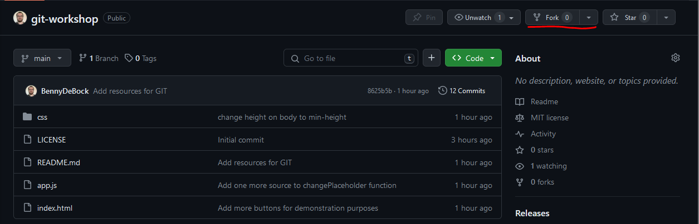
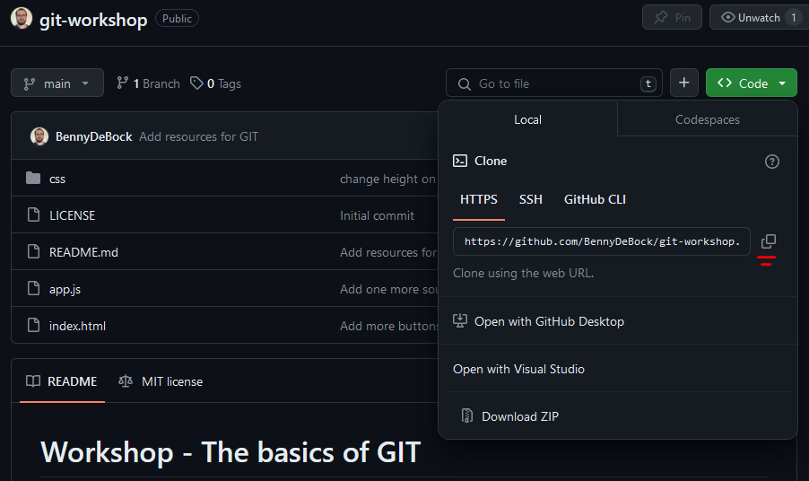

# Workshop - The basics of GIT

## Prerequisites
### GIT
#### Install
To start with this workshop, you should install GIT. You can install Git from here: [https://git-scm.com/downloads](https://git-scm.com/downloads).  
Once you have installed GIT, verify your installation by opening your command prompt/powershell/terminal and type:
```bash
git -v
```

#### Configuration
Before you can use git, you need to configure 2 parameters. We shall do this by running these commands:
```bash
git config --global user.name "John Doe"
git config --global user.email johndoe@example.com
```

> Note: replace John Doe and the email with your own name and email (preferably the email that you use for your github account)

### Github
This workshop will use Github, so make you you have a account. If you don't have one, you can create one using the sign up button here: [Github](https://github.com/)

## Creating your first commit
### Step 1 - Fork a repository
If you've created your Github account, and you are logged in, press the fork button in the top right corner of this repository.


Make sure the owner is listed as your own account and leave all options as is. Once you've forked the repository, you should be able to find it under your repositories. Open that repository in Github

### Step 2 - Clone your newly created repository
Now that your repository is open, you should see the same files as there were in the repository that you forked from. Now we will clone this repo to our device.

Start by copying the git url. You can find this if you open the green code button, and under HTTPS there should be a link you can copy.


Once you have done that, open your terminal, navigate to whatever folder you'd like the project to be and run the following command:
```bash
git clone https://github.com/<your github name>/git-workshop.git
```

This will clone your repo from github to your local machine in a folder with the same name as the repository.

### Step 3 - Make your first commit
- [x] Clone the repository
- [ ] Change the H1 tag to something of your choosing
- [ ] Stage the change
- [ ] Commit the change
- [ ] Create a file with the name `hobbies.md` and the content of hobbies.txt in the file
- [ ] Stage the change
- [ ] Commit the change
- [ ] Push the changes to Github

> **Note:** If at any point you are unsure of the files you have staged for a commit, you can use `git status`. This command tells you on which branch you are, as well as which files have been modified/staged, how many commits have been done, etc...

#### Extra challenges
- [ ] Add more sources to the `changePlaceholder` function in `app.js`
- [ ] Add deletion of the placeholder element when the `Delete placeholder` button is clicked

## Branches
### Step 4 - Create and switch to branch
- [ ] Create a branch called `development`
- [ ] Switch to the `development` branch

>  You can verify whether this succeeded when you use `git status` in the terminal.

- [ ] Make a small change to the `hobbies.md` file
- [ ] Commit the change
- [ ] Push to Github

> You will get a fatal error saying `fatal: The current branch development has no upstream branch`. This is normal when the branch you have created does not exist on Github. To fix this, run `git push --set-upstream origin <name of branch>`. You only need to run this the first time you are pushing to the new branch.

> **Note:** Not every branch needs to be in Github, if you're experimenting, then feel free to not push to Github

### Step 5 - Merging branches
- [ ] Make sure you are on the `development` branch
- [ ] Create a branch called `hotfix-hobbies` 
- [ ] Make a change to the `hobbies.md` file and commit
- [ ] Go back to the `development branch`

#### Updating branches

#### Resolving merge conflicts


### Step 8 - Branch protection


## Resources
[Oh shit, GIT!?!](https://ohshitgit.com/)  
[GIT.WTF!?!](https://git.wtf/)
[Git Book by Scott Chacon](https://git-scm.com/book/en/v2)

https://jonathanmh.com/p/how-to-create-a-git-merge-conflict/